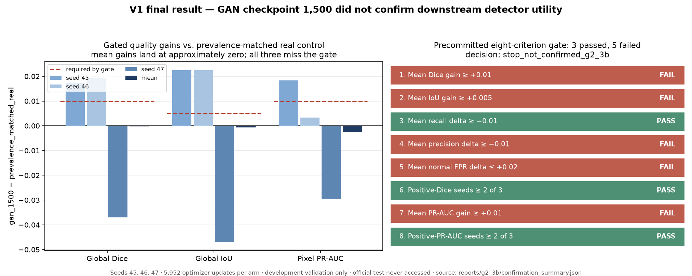
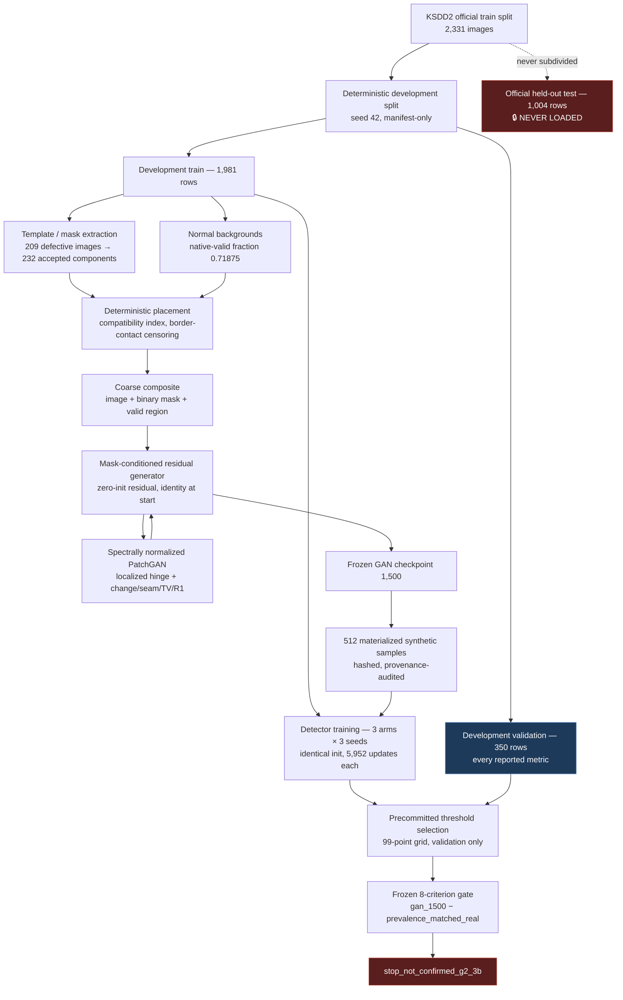

# Defect Generator & Detector

[](https://github.com/Vishalkumar2006/defect-generator-detector/actions/workflows/tests.yml)
[](LICENSE)
[](https://creativecommons.org/licenses/by-nc-sa/4.0/)

A research-oriented PyTorch pipeline investigating whether GAN-generated
industrial surface defects can improve downstream defect segmentation.

**Version 1 is complete and frozen. Its controlled experiments did *not* confirm
robust incremental detector utility from the synthetic samples.**

The final scientific decision is `stop_not_confirmed_g2_3b`. Under a protocol
frozen before any detector was trained, GAN-augmented training produced a mean
Dice gain of **−0.0002** against a prevalence-matched real control —
approximately zero across the three precommitted seeds — and five of eight
precommitted gate criteria failed.
That negative result is the deliverable. It is reported here in full rather than
buried, because the experimental machinery built to *establish* it is the
substantive contribution.



---

## Overview

### The problem

Industrial surface-defect detection is a chronically data-starved supervised
learning problem. In KSDD2, the dataset used here, only **356 of 3,335** images
contain a defect — and the development training split holds just **209**
defective images. Defects are rare, visually diverse, expensive to photograph,
and expensive to annotate at pixel level.

### The idea

If a generative model could synthesize *new* defective images, the detector would
see more positive examples and should generalize better. This is a widely
assumed, widely published augmentation strategy.

### The question this project actually asks

Assuming more defect exposure helps is not the same as showing that *synthetic*
defect exposure helps. A synthetic sample is defective by construction, so adding
synthetic data to a class-balanced batch silently raises the fraction of
defective samples the detector sees. Any measured gain could come from the
synthetic *content* — or merely from the changed *prevalence*.

So the pipeline was built to close that loop honestly:

```
real defective images
  → template / mask extraction        (development-training images only)
  → deterministic placement on normal backgrounds
  → mask-conditioned residual GAN     (refines the composite locally)
  → synthetic training images
  → segmentation detector             (equal budget, identical initialization)
  → matched-real controlled evaluation
```

The last box is the one that matters, and it is the one most published pipelines
omit.

---

## Project status

| Component | Status |
|---|---|
| V1 data pipeline & preprocessing | ✅ **Complete** — audited extraction, deterministic split, native-geometry canvas |
| V1 real-only baseline detector | ✅ **Complete** — accepted BF16 reference, validation Dice `0.7777` |
| V1 GAN (architecture → sustained training) | ✅ **Complete** — 2,000 sustained joint updates, numbered checkpoints |
| V1 synthetic materialization | ✅ **Complete** — 512 audited samples per checkpoint |
| V1 downstream evaluation (G2.2 → G2.3A → G2.3B) | ✅ **Complete** — all authorized experiments executed |
| **V1 downstream utility result** | ❌ **NOT CONFIRMED** — `stop_not_confirmed_g2_3b` |
| Official held-out KSDD2 test split | 🔒 **Never accessed** — never constructed, inspected, counted, or evaluated |
| Version 2 | 📋 **Planned — not implemented.** No V2 code, config, experiment, or branch exists |

Frozen at commit `a794625`. Test suite: **448 passed**.

---

## Research question

> **Can synthetic defects provide detector utility beyond what an equivalent
> amount of real-defect exposure already provides?**

Note the phrasing. The naive question — "does adding synthetic data help?" — is
answerable but uninformative, because a synthetic-augmented arm differs from a
plain baseline in *two* ways at once: it has different image content, and it has
a higher effective defect prevalence.

The controlled question isolates the first by matching the second. That requires
three arms, not two:

| Arm | Normal-real | Defective-real | Synthetic | Effective defective fraction |
|---|---:|---:|---:|---:|
| A — `standard_real` | 50.0% | 50.0% | 0% | `0.500` |
| B — `prevalence_matched_real` | 37.5% | 62.5% | 0% | `0.625` |
| C — `gan_1500` | 37.5% | 37.5% | 25.0% | `0.625` |

**B is the control that matters.** B and C are slot-for-slot identical except at
one batch position, where B draws the next real defective image and C draws the
next synthetic one. Both carry the same 0.625 effective defect prevalence, so
`C − B` isolates synthetic *content* with prevalence held fixed.

`A − B` is reported as a secondary, ungated measurement: the pure prevalence
effect, using real data only.

---

## System architecture



### Design choices worth noting

- **Residual, not generative-from-scratch.** The generator refines a real
  composite rather than hallucinating a whole image. Its residual head is
  zero-initialized, so it starts at *exact identity*, and `torch.where` preserves
  every pixel outside the dilated defect support bit-for-bit. Maximum directional
  residual magnitude is clamped at `0.25`.
- **Native geometry, never resized.** KSDD2 images are tall narrow strips
  (~230 × 630 px). The measured maximum is 241 × 665, rounded up to a **256 × 672**
  canvas. Images are reflection-padded; masks are **zero**-padded so reflection
  cannot manufacture positive labels at a border. A `valid_region` tensor excludes
  every padded pixel from all losses and metrics.
- **Manifest-only loading.** No loader discovers samples by directory globbing.
  Every sample identity comes from a hashed, validated manifest.

---

## V1 methodology

<details>
<summary><b>Dataset and splits</b></summary>

[KSDD2](https://www.vicos.si/resources/kolektorsdd2/) — 3,335 images with
pixel-level masks, treated as strictly binary (normal / defective); no defect-type
labels are invented.

| Official split | Development split | Rows | Role |
|---|---|---:|---|
| `train` | `train` | 1,981 | All training, template extraction, GAN sources |
| `train` | `validation` | 350 | Every metric reported in V1 |
| `test` | `test` | 1,004 | **Sealed. Never loaded.** |

The official test split is never resplit and never used for any development
decision. The split manifest is content-hashed
(`024495c9…`, 616,772 bytes, 3,335 rows) and regenerates byte-identically.
</details>

<details>
<summary><b>Preprocessing</b></summary>

Complete images, no aspect-ratio distortion, no interpolation. Symmetric padding
onto the 256 × 672 canvas: reflection for pixels, constant zero for labels.
Original dimensions and per-side offsets travel with each sample so predictions
restore exactly to native size. Two nonconforming archive duplicates
(`10301 (copy).png` and its mask) are excluded from every manifest and loader,
and are never deleted.
</details>

<details>
<summary><b>Real-only baseline detector</b></summary>

GroupNorm U-Net, 3→1 channels, base width 32, 28.3 M parameters. Valid-region
BCE-with-logits (`pos_weight` 5) + soft Dice, weights 1/1, computed in float32.
AdamW LR `3e-4`, weight decay `1e-4`, gradient clip 1.0, `ReduceLROnPlateau`
(factor 0.5, patience 2, min LR `1e-5`). BF16 forward with **no** GradScaler and
no fp32 retry.

An earlier FP16 attempt failed on genuine infinite-gradient events during epoch-4
validation. It was not patched into passing — it was diagnosed, documented
(`docs/failed-fp16-baseline.md`), retired, and replaced by the BF16 configuration.

| Accepted baseline | Threshold 0.5 | Swept 0.05 |
|---|---:|---:|
| Global Dice | `0.7777` | `0.7983` |
| Global IoU | `0.6363` | `0.6642` |
| Pixel precision | `0.8548` | `0.7756` |
| Pixel recall | `0.7134` | `0.8223` |
| Normal-image FPR | `0.0415` | `0.0639` |

Best epoch 11 of 12; 5,952/5,952 optimizer updates; zero numerical anomalies.
</details>

<details>
<summary><b>Residual GAN</b></summary>

**Generator** — mask-conditioned residual U-Net. Zero-initialized output head
(exact identity at initialization), range-aware clamping, exact pixel preservation
outside the dilated support.

**Discriminator** — spectrally normalized mask-conditioned PatchGAN. Dilated mask
projection prevents unrelated background logits from dominating; a shared
canonical mask policy keeps real and fake conditioning formats identical.

**Objectives** — localized raw-logit hinge, plus change, seam, total-variation,
and lazy-R1 primitives, all restricted to the defect support and its inner
boundary.

**Training** — G1.4 bounded mechanics audit → G1.5 gated smoke → G1.6 clipping
ablation → **G2.1**: one authorized 2,000-update sustained run from fresh
initialization. Numbered recovery checkpoints only; no "best" checkpoint was ever
manufactured from monitor confidence or visual panels.
</details>

<details>
<summary><b>Leakage guards</b></summary>

- Template extraction, background sampling, GAN training, and synthetic
  generation consume **development-training rows only**.
- Detector-validation source overlap in the synthetic manifest: **0**.
- Official-test rows read, counted, or inspected: **0**, verified in every report.
- All 512 synthetic samples audited: every mask's support lies entirely inside
  `valid_region` (0 outside pixels); every sample carries at least one positive
  valid defect pixel; 512/512 rows declare both `official_split=train` and
  `development_split=train`.
- All 1,536 per-row image/mask/valid-region file hashes re-verified at every run.
</details>

<details>
<summary><b>Determinism and reproducibility</b></summary>

Seeded and hash-verified throughout: content hashes on configs, schedules,
manifests, and checkpoints; arm-independent draw streams keyed by
`experiment_version:seed:epoch:class` (containing no arm, so no arm can perturb
another's draws); identical initialization enforced within a seed by comparing
`initialization_sha256` across arms before training may continue; atomic and
resumable checkpoint writes.
</details>

### The experimental sequence

| Phase | What it did | Outcome |
|---|---|---|
| **G2.1** | One authorized 2,000-update sustained GAN run | Completed clean — no output-range, locality, or non-finite-gradient violations |
| **G2.2** | First downstream utility test, checkpoints 1,000 vs 1,500, 2,000-update detectors | `stop_not_confirmed` — and, as later shown, **confounded** |
| **G2.3A** | Post-hoc diagnostic. Trained *nothing*: 0 GAN updates, 0 detector updates, 6 validation-only forward passes | Diagnosed exactly why G2.2 was uninterpretable |
| **G2.3B** | Corrected experiment. Prevalence-matched control, mature budget, 3 fresh seeds, gate frozen before training | **FAIL — `stop_not_confirmed_g2_3b`** |

---

## Key result

### How the answer changed under scrutiny

**G2.2 looked interpretable and was not.** Its synthetic arms appeared to trade
recall for other metrics, and it failed its recall gate. But G2.3A — recomputing
from the saved 8,000-row schedules, without training anything — established as
fact that **every G2.2 synthetic arm trained at `0.625` effective defective
fraction while its real-only control trained at `0.500`**. Each synthetic sample
is defective by construction and displaced a class-balanced real draw. No G2.2
comparison could separate synthetic *content* from defect *prevalence*.

G2.3A found three further defects, all measured:

1. **Underconvergence** — 2,000 updates is 4.03 baseline epochs, **33.6%** of the
   mature budget. Every arm's training loss was still falling.
2. **Control instability** — control Dice ranged `0.406`–`0.623` (s.d. `0.109`);
   control normal-image FPR ranged `0.597`–`0.927` against the converged
   baseline's `0.0415`.
3. **Calibration shift** — all six G2.2 checkpoints preferred a best-Dice
   threshold *above* 0.5, several above 0.95, while the converged baseline
   preferred `0.05`. Comparing everything at a fixed 0.5 was measuring
   calibration, not quality.

**G2.3B fixed all four by construction**: a prevalence-matched real control, a
mature 5,952-update budget, three fresh seeds (45/46/47 — never used by any
earlier phase, so the experiment could not re-test its own design data),
precommitted operating-point selection, and an added threshold-independent PR-AUC
criterion. The full gate was frozen at commit `7a069a5`, **before any G2.3B
detector was trained**.

### The final gate

Primary comparison `gan_1500 − prevalence_matched_real`, over seeds 45/46/47, at
each arm's precommitted selected threshold. All eight criteria had to hold.

| # | Criterion | Required | Observed | Outcome |
|---|---|---:|---:|---|
| 1 | Mean global Dice gain | `≥ +0.01` | `−0.000196` | ❌ **FAIL** |
| 2 | Mean global IoU gain | `≥ +0.005` | `−0.000675` | ❌ **FAIL** |
| 3 | Mean pixel recall delta | `≥ −0.01` | `+0.022999` | ✅ PASS |
| 4 | Mean pixel precision delta | `≥ −0.01` | `−0.026376` | ❌ **FAIL** |
| 5 | Mean normal-image FPR delta | `≤ +0.02` | `+0.028754` | ❌ **FAIL** |
| 6 | Seeds with positive Dice gain | `≥ 2 of 3` | `2` | ✅ PASS |
| 7 | Mean pixel PR-AUC gain | `≥ +0.01` | `−0.002608` | ❌ **FAIL** |
| 8 | Seeds with positive PR-AUC gain | `≥ 2 of 3` | `2` | ✅ PASS |

**Three passed, five failed → `stop_not_confirmed_g2_3b`.**

Criteria 1–6 were carried over *numerically unchanged* from G2.2 — including the
`−0.01` recall tolerance G2.2 actually failed. Criteria 7–8 were **added, never
substituted**, so the gate could only become harder to pass. A test
(`test_gate_thresholds_are_not_weaker_than_the_frozen_g2_2_rules`) asserts this.

### Per-seed detail — the result is dispersion, not a uniform deficit

| Seed | Dice gain | IoU gain | Precision Δ | Recall Δ | Normal-FPR Δ | PR-AUC gain |
|---:|---:|---:|---:|---:|---:|---:|
| 45 | `+0.017308` | `+0.022460` | `−0.032406` | `+0.086529` | **`+0.102236`** | `+0.018274` |
| 46 | `+0.019141` | `+0.022429` | `−0.042661` | `+0.061332` | `−0.009585` | `+0.003292` |
| 47 | **`−0.037037`** | **`−0.046913`** | `−0.004060` | `−0.078865` | `−0.006390` | **`−0.029391`** |
| **Mean** | **`−0.000196`** | **`−0.000675`** | **`−0.026376`** | **`+0.022999`** | **`+0.028754`** | **`−0.002608`** |

Seeds 45 and 46 show small positive gains on Dice, IoU, and PR-AUC. Seed 47
reverses all three by a larger margin, pulling the means to approximately zero.
Criterion 5 fails almost entirely on seed 45, whose `gan_1500` arm selected a low
threshold (0.11) that bought a large recall gain at the cost of a `+0.1022`
normal-image false-positive regression; the other two seeds' FPR deltas are
slightly negative.

### The prevalence effect itself was small and unstable

Secondary, ungated — `standard_real − prevalence_matched_real`, mean Dice
`+0.0186`, with per-seed signs `−0.043 / +0.049 / +0.049`. Raising real defect
prevalence from 0.500 to 0.625 at a mature budget moved Dice in the *opposite*
direction from the G2.2-era assumption, and not consistently. The confound G2.3A
proved was real, but its mature-budget magnitude was not large enough to have
been the sole cause of G2.2's failure.

### What this does and does not mean

> **The detector-utility hypothesis was not confirmed. The generator pipeline did
> not technically fail.**

These are different claims and the distinction is the point.

**Not demonstrated: that the GAN improved detector performance.** No controlled
multi-seed experiment in V1 established a robust detector-performance improvement
from GAN augmentation.

**Also not demonstrated: that the synthetic images are bad.** V1 measured
*downstream detector utility*, not generator quality. All 512 materialized samples
passed every structural audit — valid-region-contained support, positive defect
pixels, aligned shapes, train-only provenance. G2.1 completed 2,000 sustained
joint updates with no output-range, locality, invalid-gradient, or non-finite
gradient violations. **"Utility not confirmed" is not "images are bad."**

**Genuinely uncertain: whether a small true effect exists.** With three seeds and
per-seed Dice gains spanning `−0.037` to `+0.019`, this experiment cannot
distinguish a small positive effect from zero. It *can* and does exclude the
large positive effect the precommitted gate required.

A useful calibration: the accepted real-only baseline reaches validation Dice
`0.7777`, and the nine G2.3B arms span `0.6839`–`0.8113` at their selected
thresholds — materially more converged than any G2.2 arm, whose best Dice at
*any* threshold was `0.6729`.
Eight of nine mature checkpoints preferred a threshold *below* 0.5, matching the
converged baseline and reversing G2.3A's observation about the immature ones. The
mature budget resolved the calibration pathology.

### Why the project stopped here

The gate was designed before training precisely so that the stopping decision
could not be renegotiated afterwards. Five of eight criteria failed. Under the
rules agreed in advance, that is `stop_not_confirmed_g2_3b`.

A FAIL is not an invitation to relax the gate, add seeds, retune a threshold,
change the synthetic fraction, substitute another GAN checkpoint, or train the
GAN longer until something passes. The value of this result is that it is
*attributable* in a way G2.2's never was.

---

## What V1 taught us

1. **Sample quantity is not information diversity.** Every synthetic defect's
   geometry originates in a limited real template library: 209 defective
   development-training images yielding 235 connected components, 232 accepted,
   96 border-touching — transformed only by scale in `[0.9, 1.1]` and H/V flips.
   512 synthetic samples is not 512 new pieces of information.
2. **Visual plausibility is not downstream utility.** Adversarial realism,
   generator-side health, and structurally valid composites all held. The
   detector-side benefit still did not appear. Generator metrics do not predict
   detector metrics.
3. **Matched controls decide what a result means.** The single most valuable
   artifact in this project is G2.3A — a diagnostic that trained nothing and
   changed the interpretation of everything before it. Without a
   prevalence-matched control, G2.2's numbers were uninterpretable in principle,
   not merely noisy.
4. **Convergence and calibration are experimental variables, not details.**
   Comparing underconverged models at a fixed threshold measures calibration
   drift. Mature budgets and precommitted operating-point selection were required
   before the comparison meant anything.
5. **Precommitted gates prevent cherry-picking — including your own.** Freezing
   the eight criteria before training, carrying over the exact criterion the
   previous phase had failed, and *adding* rather than substituting new ones, is
   what makes this negative result trustworthy.
6. **A well-built negative result is a real deliverable.** The infrastructure —
   deterministic schedules, hash-verified identity, leakage guards, atomic
   resumable training, 448 tests — is what allowed the conclusion to be stated
   with confidence instead of hedged.

---

## V2 direction

> ### `Planned — not implemented`
>
> **Nothing in this section exists.** No V2 code, config, experiment, result, or
> branch has been created. This records the research direction under discussion
> when V1 was frozen so it is not lost. It is not a plan of record, it is not
> authorized, and it must not be read as a claim about anything that was built.

Under consideration, motivated directly by the V1 limitations above:

- **Novel defect geometry** — generate genuinely new shapes rather than only
  transforming real-derived masks (addresses lesson 1).
- **Latent / style diversity** — introduce explicit stochastic appearance
  variation; V1 has no latent noise input, no style vector, and no diversity
  objective.
- **Separated shape and appearance latents** — so geometry and texture can vary
  independently.
- **Hard-example targeting** — steer generation toward detector weaknesses, using
  training-only or out-of-fold evidence; never development validation, never the
  official held-out split.
- **Diversity-aware and utility-aware objectives** — rather than relying on
  adversarial realism as a proxy for usefulness (addresses lesson 2).
- **Conditional diffusion / inpainting** — considered as an alternative if a
  GAN-based V2 proves insufficient.

Any V2 experiment requires its own precommitted protocol, its own frozen gate, and
its own explicit authorization. It must not reuse V1's seeds (42–47) for
confirmation, and it must not alter V1's recorded results.

---

## Repository structure

```
defect-generator-detector/
├── src/defectgen/              # Library code
│   ├── data/                   # KSDD2 loading, splits, geometry, patches, sampling
│   ├── gan/                    # Input pipeline, placement, training pairs, manifests
│   ├── models/                 # U-Net detector; residual generator + PatchGAN
│   └── training/               # Engine, losses, metrics, numerics, phase protocols
├── scripts/                    # 33 CLI entry points (audit / train / visualize / demo)
├── configs/                    # Frozen experiment configurations — see configs/README.md
├── tests/                      # 448 tests across 25 files
├── docs/                       # Design docs and experiment records — START AT docs/README.md
│   ├── V1_FINAL_STATE.md       #   ← AUTHORITATIVE project status
│   ├── g2-3b-results.md        #   ← the terminal result
│   ├── g2-3-diagnostic.md      #   ← why G2.2 was confounded
│   └── dataset-setup.md        #   ← how to obtain and verify KSDD2
├── reports/                    # Machine-readable experiment evidence (numbers only)
│   ├── g2_3b/confirmation_summary.json   # ← the authoritative final result
│   ├── g2_3/diagnostic/        #   G2.3A evidence
│   └── final_real_baseline_bf16_seed42/  # accepted baseline evidence
├── assets/                     # Generated figures (no dataset pixels)
├── data/                       # Local only — you supply KSDD2; see docs/dataset-setup.md
├── LICENSE                     # MIT — covers this repository's own code
└── THIRD_PARTY_NOTICES.md      # KSDD2 (CC BY-NC-SA 4.0) and dependency attribution
```

**Historical experiment reports live under `reports/` and are kept separate from
source code.** They are evidence, not libraries. Nothing in `src/` reads them at
runtime.

---

## Installation

### Requirements

| Component | Tested value | Notes |
|---|---|---|
| Python | **3.14.2** | The code uses `X | None` syntax, so 3.10+ is required. Only 3.14.2 was tested. |
| PyTorch | **2.11.0+cu128** | |
| CUDA | **12.8** | Required for training |
| GPU | NVIDIA RTX 4050 Laptop (6 GB) | BF16 support **required** — training refuses a CPU fallback |
| OS | **Windows 11**, PowerShell | Linux commands are given below but were **not** tested |

CPU alone is sufficient for the test suite, the audits, and the single-image demo.
It is **not** sufficient for training: the baseline and G2.3B protocols require
CUDA with BF16 and deliberately refuse to silently fall back.

### Windows (PowerShell) — the tested path

```powershell
git clone https://github.com/Vishalkumar2006/defect-generator-detector.git
cd defect-generator-detector

python -m venv .venv
.\.venv\Scripts\python.exe -m pip install --upgrade pip
.\.venv\Scripts\python.exe -m pip install -r requirements.txt
```

Then install PyTorch **explicitly from the CUDA index**, so pip cannot silently
select a CPU-only build:

```powershell
.\.venv\Scripts\python.exe -m pip install -r requirements-ml.txt
.\.venv\Scripts\python.exe .\scripts\verify_pytorch_environment.py
```

`verify_pytorch_environment.py` exits with an error if CUDA is unavailable — it
does not accept a silent CPU fallback.

Calling the virtual environment's Python directly (rather than activating it)
avoids PowerShell execution-policy issues. Every command in this README uses that
form.

### Linux with an NVIDIA GPU — untested equivalent

Full capability, including training. These are direct translations of the tested
Windows commands; they are expected to work but were not run here.

```bash
git clone https://github.com/Vishalkumar2006/defect-generator-detector.git
cd defect-generator-detector

python3 -m venv .venv
./.venv/bin/python -m pip install --upgrade pip
./.venv/bin/python -m pip install -r requirements.txt
./.venv/bin/python -m pip install -r requirements-ml.txt   # CUDA 12.8 wheels
./.venv/bin/python ./scripts/verify_pytorch_environment.py
```

`requirements-ml.txt` pins the CUDA 12.8 wheels. Your NVIDIA driver must support
CUDA 12.8, and the GPU must support BF16 (compute capability 8.0+, i.e. Ampere or
newer) — training refuses to run without it.

### macOS, or any machine without an NVIDIA GPU — CPU-only subset

**Training is not possible here.** There is no CUDA path on macOS, and the
baseline and G2.3B protocols deliberately refuse a CPU fallback rather than
silently producing incomparable results. Do **not** install
`requirements-ml.txt` on these machines — it points at the CUDA wheel index.

Install a CPU build of PyTorch instead:

```bash
git clone https://github.com/Vishalkumar2006/defect-generator-detector.git
cd defect-generator-detector

python3 -m venv .venv
./.venv/bin/python -m pip install --upgrade pip
./.venv/bin/python -m pip install -r requirements.txt
./.venv/bin/python -m pip install torch torchvision   # default CPU wheels
```

Skip `verify_pytorch_environment.py` — it exits with an error when CUDA is
absent, by design. What still works:

| Works on CPU | Needs CUDA + BF16 |
|---|---|
| The full 448-test suite | `train_final_real_baseline.py` |
| `plot_v1_result_summary.py` | `train_gan.py` |
| Reading every report and doc | `train_g2_3b_utility.py --mode train` |
| `demo_segment_image.py` (with a supplied checkpoint) | |
| `train_g2_3b_utility.py --mode plan` / `--mode confirm` | |

This is enough to inspect, verify, and understand every V1 result, since all of
them are recorded in tracked JSON.

### Optional editable install

Scripts and tests insert `src/` on `sys.path` themselves, so **no install is
required**. If you would rather import `defectgen` from anywhere:

```powershell
.\.venv\Scripts\python.exe -m pip install -e .
```

This deliberately does **not** declare `torch` as a dependency, so that an
editable install cannot pull a CPU-only wheel over your CUDA build.

---

## Dataset setup

**KSDD2 is not distributed with this repository** and is not covered by its MIT
licence. You must obtain it yourself.

Full instructions: **[`docs/dataset-setup.md`](docs/dataset-setup.md)**. In brief:

1. Download `KolektorSDD2.zip` from the official page:
   <https://www.vicos.si/resources/kolektorsdd2/>
2. Place the unmodified archive at `data/raw/KolektorSDD2.zip`.
3. Extract, audit, and build the split:

```powershell
.\.venv\Scripts\python.exe .\scripts\extract_ksdd2.py
.\.venv\Scripts\python.exe .\scripts\audit_ksdd2.py
.\.venv\Scripts\python.exe .\scripts\create_development_split.py
```

The audit must report `"status": "PASS"` with exactly 2,331 train and 1,004 test
images (3,335 total, 356 defective). The regenerated split must hash to
`024495c9673a7096c79f342cce58ad6dd5e7434951b9b61053e926ab7c8c9f07`. If it does
not, stop — no downstream result will be comparable to the recorded ones.

### Licence obligations

KSDD2 is licensed by its authors under
[**CC BY-NC-SA 4.0**](https://creativecommons.org/licenses/by-nc-sa/4.0/):
**Attribution**, **NonCommercial** use only, and **ShareAlike** for adaptations.
This repository's MIT licence applies to its own code and does **not** relicense
the dataset or grant you any rights in it. See
[`THIRD_PARTY_NOTICES.md`](THIRD_PARTY_NOTICES.md).

---

## Quick start

### ✅ Safe quick-start commands

None of these train anything, and none takes more than a few minutes.

```powershell
# 1. Full test suite (~4 minutes, CPU-only, no dataset required)
.\.venv\Scripts\python.exe -m pytest -q

# 2. Read the terminal V1 result
Get-Content .\reports\g2_3b\confirmation_summary.json

# 3. Regenerate the headline result figure from that JSON
.\.venv\Scripts\python.exe .\scripts\plot_v1_result_summary.py

# 4. Recompute the frozen gate from the nine completed arms (deterministic, trains nothing)
.\.venv\Scripts\python.exe .\scripts\train_g2_3b_utility.py --mode confirm

# 5. Rebuild the precommitted plan and verify it reproduces byte-identically
.\.venv\Scripts\python.exe .\scripts\train_g2_3b_utility.py --mode plan
```

Steps 1–3 need no dataset. Steps 4–5 need the local G2.3B artifacts.

**Single-image demo** — requires a locally trained detector checkpoint and a
KSDD2 image you supply:

```powershell
.\.venv\Scripts\python.exe .\scripts\demo_segment_image.py `
    --checkpoint .\checkpoints\final_real_baseline_bf16_seed42\best.pt `
    --image .\data\extracted\KolektorSDD2\train\10309.png `
    --ground-truth .\data\extracted\KolektorSDD2\train\10309_GT.png
```

It runs on CPU, writes a four-panel overlay
(`input | probability | prediction | ground truth`) to `reports/demo/`, and prints
a JSON summary including Dice against the supplied mask. It trains nothing, writes
no checkpoint, and alters no recorded report.

> **No checkpoint ships with this repository.** Checkpoints total ~17 GB locally
> and are Git-ignored. Produce one with `scripts/train_final_real_baseline.py`, or
> point `--checkpoint` at any detector checkpoint this project saved.

### ⚠️ Historical expensive training commands — do not run casually

These reproduce V1's experiments. They require CUDA + BF16 and take **many
hours**. They are listed for completeness and reproducibility, not as part of the
quick start.

```powershell
# Real-only BF16 baseline — 12 epochs, hours on a laptop GPU
.\.venv\Scripts\python.exe .\scripts\train_final_real_baseline.py --config .\configs\final_real_baseline_bf16.json

# G2.1 sustained GAN training — 2,000 joint updates
.\.venv\Scripts\python.exe .\scripts\train_gan.py --config .\configs\gan_training_2000.json

# G2.3B — nine arms, ~14 HOURS total
.\.venv\Scripts\python.exe .\scripts\train_g2_3b_utility.py --mode train --seed 45
.\.venv\Scripts\python.exe .\scripts\train_g2_3b_utility.py --mode train --seed 46
.\.venv\Scripts\python.exe .\scripts\train_g2_3b_utility.py --mode train --seed 47
```

**In this repository these are terminal and must not be re-run.** V1's
checkpoints and results are frozen; rerunning an arm would overwrite completed
experimental evidence. The commands above are the reproduction recipe for a fresh
clone, not maintenance operations for this one. `docs/V1_FINAL_STATE.md` §I lists
every command that requires new explicit authorization.

---

## Reproducing V1

There are two meaningfully different targets.

### Ordinary code-level reproduction

Rerun the pipeline from scratch on your own machine and obtain your own numbers.
Needs: this repository, KSDD2, and a CUDA + BF16 GPU. Staged path:

| # | Stage | Command | Cost |
|---|---|---|---|
| 1 | Extract, audit, split | `extract_ksdd2.py` → `audit_ksdd2.py` → `create_development_split.py` | minutes |
| 2 | Preprocessing analysis | `analyze_defect_geometry.py` → `analyze_full_image_data.py` | minutes |
| 3 | Baseline detector | `train_final_real_baseline.py --config configs/final_real_baseline_bf16.json` | hours |
| 4 | GAN input manifest | `build_gan_input_manifest.py` → `audit_gan_sampling.py` | minutes |
| 5 | GAN training | `train_gan.py --config configs/gan_training_2000.json` | hours |
| 6 | Synthetic materialization | `build_g2_2_synthetic_manifests.py` | minutes |
| 7 | Downstream experiment | `train_g2_3b_utility.py --mode plan / train / confirm` | ~14 hours |

Every stage writes a hashed report, so you can compare your artifacts to the
recorded ones at each step rather than only at the end.

**Bitwise identity across different hardware is not claimed.** Schedule content
hashes, per-epoch composition, and update budgets *are* hardware-independent and
will reproduce exactly.

### Exact historical reproduction

Reusing the identical frozen weights and synthetic pixels, and re-verifying the
recorded hashes, additionally requires local artifacts that are **not in Git**:

| Artifact | Size | Why it is needed |
|---|---:|---|
| `data/` (raw + extracted + processed KSDD2) | ~2.0 GB | Any retraining or re-materialization |
| `checkpoints/` (111 `.pt` files) | ~17 GB | Reusing frozen weights; `joint_1500.pt` is required by any G2.3B re-verification |
| `data/synthetic/` (2,048 files) | ~319 MB | Arm C reads these directly and re-hashes all 1,536 per-row files |

These exist only on the machine where V1 ran. Their hashes, sizes, and expected
paths are recorded in `docs/V1_FINAL_STATE.md` §I so their identity is verifiable
even though the bytes are absent — for example
`checkpoints/gan_training_2000/joint_1500.pt`, 79,262,487 bytes, SHA-256
`5af1c6aafabcc0444117aa43209dcab168e57f4489259728e8f9066a4fdf1c81`.

No pretrained third-party weights were used anywhere; every checkpoint was
trained from random initialization on development-training data only.

---

## Testing

```powershell
.\.venv\Scripts\python.exe -m pytest -q
```

**448 tests across 25 files, all passing**, in roughly 4 minutes on CPU. This
matches the count recorded at freeze, and no test requires a GPU.

### Continuous integration

[`.github/workflows/tests.yml`](.github/workflows/tests.yml) runs on every push
and pull request, on CPU, and **never downloads KSDD2** — CI must not fetch
third-party data this project does not redistribute.

8 of the 448 tests read actual KSDD2 image files, so CI deselects them **by name
in the workflow**, leaving the test files byte-identical to the ones that
produced the recorded result. CI therefore reports **435 passed, 5 skipped,
8 deselected**; run the suite locally with the dataset present to see all 448.

CI additionally asserts that `reports/g2_3b/confirmation_summary.json` still
records `stop_not_confirmed_g2_3b`, `confirmed: false`, zero official-test
accesses, and zero GAN optimizer updates — so a regression in the frozen V1
result would fail the build.

The tests are not incidental — they encode the experimental protocol itself:

| Suite | Tests | What it protects |
|---|---:|---|
| `test_g2_3b_protocol.py` | 63 | Batch composition, update budgets, initialization equality, deterministic schedules, synthetic identity, validation-only threshold selection, official-split refusal, gate arithmetic |
| `test_g2_3b_durability.py` | 43 | Atomic writes, run identity, resume compatibility, completed-epoch/arm protection, state round-trip, LR restoration, plan-unchanged assertions |
| `test_g2_3_diagnostic.py` | 44 | G2.3A guards, histograms, curve and PR-AUC mathematics, composition and mask primitives |
| Remaining 22 files | 298 | Extraction, splits, geometry, patches, dataset contracts, losses, metrics, numerical stability, GAN architecture / losses / pairs / trainer / smoke / ablation |

Notable examples: `test_gate_thresholds_are_not_weaker_than_the_frozen_g2_2_rules`
asserts that no carried-over gate value was weakened, and a test asserts that
`scripts/train_g2_3b_utility.py` contains no quoted reserved-split literal.

---

## Reproducibility and leakage controls

| Control | How it is enforced |
|---|---|
| **Deterministic seeds and schedules** | Per-`(seed, epoch, class)` draw streams keyed `experiment_version:seed:epoch:class` — the key contains **no arm**, so no arm can perturb another's draws; each arm consumes a prefix of the identical stream |
| **Identical initialization** | The runner refuses to continue unless all three arms in a seed report the same `initialization_sha256` |
| **Content hashes** | Configs, schedules, manifests, and plans are content-hashed; `--mode plan` reproduced `precommitted_plan.json` **byte-identically** after a later durability commit |
| **Checkpoint hashes** | Whole-file SHA-256 recorded for every frozen checkpoint and re-verified at every run; checkpoints 1,000 and 2,000 are **refused by name** in G2.3B |
| **Train-only GAN sources** | Templates, backgrounds, and synthetic sources come from development-training rows only; detector-validation source overlap is **0** |
| **Validation boundaries** | Development validation is used only for metrics and precommitted threshold selection — never for template extraction, GAN training, synthetic sampling, or detector training |
| **Official-test sealing** | `assert_permitted_split` admits development `train`/`validation` only and raises `OfficialTestAccessError` otherwise; `train_g2_3b_utility.py` has **no** official-test mode; `official_test_access_count` is `0` in every recorded report |
| **Equal budgets** | Exactly 5,952 successful optimizer updates per arm, zero skipped updates (a skip is fatal); early stopping is **monitor-only** and never acted on |
| **Atomic, resumable training** | Atomic checkpoint writes, run-identity verification, completed-epoch and completed-arm protection; all nine arms in fact ran start-to-finish with no resume events |

---

## Results and reports

Start with the compact sources rather than the several hundred report files.

| I want… | Read |
|---|---|
| The one-paragraph answer | This README's [Key result](#key-result) |
| The authoritative project status | [`docs/V1_FINAL_STATE.md`](docs/V1_FINAL_STATE.md) |
| The terminal result, narrated | [`docs/g2-3b-results.md`](docs/g2-3b-results.md) |
| **The machine-readable final result** | [`reports/g2_3b/confirmation_summary.json`](reports/g2_3b/confirmation_summary.json) |
| Why the earlier experiment was confounded | [`docs/g2-3-diagnostic.md`](docs/g2-3-diagnostic.md) |
| Proof the gate predates the training | [`docs/g2-3b-utility-protocol.md`](docs/g2-3b-utility-protocol.md), [`reports/g2_3b/plan/precommitted_plan.json`](reports/g2_3b/plan/precommitted_plan.json) |
| The accepted baseline's evidence | [`reports/final_real_baseline_bf16_seed42/summary.json`](reports/final_real_baseline_bf16_seed42/summary.json) |
| A guided tour of all documentation | **[`docs/README.md`](docs/README.md)** |

---

## Limitations

Stated directly.

1. **Measured.** Synthetic augmentation from frozen GAN checkpoint 1,500 did not
   add robust detector utility beyond matched real-defect exposure — on
   threshold-dependent quality and threshold-independent PR-AUC alike.
2. **Measured.** Adversarial realism is not equivalent to downstream utility.
   Generator-side health does not predict detector-side benefit.
3. **Measured.** Defect geometry derives from a **limited real template library**
   (232 accepted components from 209 images), varied only by scale `[0.9, 1.1]`
   and flips.
4. **Small sample.** Three seeds. The experiment cannot distinguish a small
   positive effect from zero; seed 47 alone reverses the sign of the mean on
   Dice, IoU, and PR-AUC.
5. **Interpretation, not measured.** The residual mask-conditioned formulation
   appears to emphasize local *refinement* over generating novel defect
   information. The architecture supports this reading, but no experiment
   isolated "novel information" from "plausible refinement."
6. **Interpretation, not measured.** V1 has limited explicit stochastic
   diversity — no latent noise input, no style vector, no diversity objective. No
   diversity metric was computed, so the *magnitude* of this limitation is
   unquantified.
7. **Development-validation only.** Every number in V1 comes from the 350-row
   development validation split. **Nothing is known about official held-out test
   behaviour**, by design.
8. **One configuration tested.** One synthetic ratio, one GAN checkpoint, one
   generator formulation. Nothing here shows that synthetic augmentation is
   useless in general, or that a different design would also fail — and nothing
   here justifies assuming a different design would succeed.
9. **Single-machine hardware.** One GPU, one OS. Bitwise cross-hardware
   reproduction is not claimed.

---

## Roadmap

| Version | Status |
|---|---|
| **V1** | ✅ Complete and frozen at `stop_not_confirmed_g2_3b`, tag `v1.0.0` |
| **V2** | 📋 **Planned — not implemented.** See [V2 direction](#v2-direction). No code exists. |

V2 must branch conceptually from the frozen V1 state and must not rewrite it.
V1's commits, reports, configs, gates, and recorded results are immutable history:
a V2 experiment may cite them, must not modify them, and must not reuse seeds
42–47 for its own confirmation.

---

## Citation and acknowledgement

### Dataset

This project would not exist without KSDD2, released by the Visual Cognitive
Systems Laboratory, University of Ljubljana, under CC BY-NC-SA 4.0:

```bibtex
@article{Bozic2021MixedSupervision,
  title   = {Mixed supervision for surface-defect detection:
             from weakly to fully supervised learning},
  author  = {Bo{\v{z}}i{\v{c}}, Jakob and Tabernik, Domen and Sko{\v{c}}aj, Danijel},
  journal = {Computers in Industry},
  volume  = {129},
  pages   = {103459},
  year    = {2021},
  doi     = {10.1016/j.compind.2021.103459}
}
```

Dataset page: <https://www.vicos.si/resources/kolektorsdd2/>

### Methods

The detector and generator are original implementations written from published
architectural descriptions — U-Net (Ronneberger et al., 2015), PatchGAN
(Isola et al., 2017), spectral normalization (Miyato et al., 2018), and the R1
gradient penalty (Mescheder et al., 2018). No third-party model code was copied
and no pretrained weights were used. Full attribution:
[`THIRD_PARTY_NOTICES.md`](THIRD_PARTY_NOTICES.md).

### Licence

This repository contains material under **two different licences**. The
distinction is deliberate and binding.

| Material | Licence |
|---|---|
| This project's code, configs, docs, `assets/`, and numeric reports | **[MIT](LICENSE)** |
| **KSDD2 itself** — not distributed here; you obtain it yourself | **[CC BY-NC-SA 4.0](https://creativecommons.org/licenses/by-nc-sa/4.0/)** |
| **KSDD2-derived figures** — 48 files present in Git history only | **[CC BY-NC-SA 4.0](https://creativecommons.org/licenses/by-nc-sa/4.0/)** |

**The MIT licence does not cover KSDD2 or any KSDD2-derived figure**, does not
relicense them, and grants no rights in them. [`LICENSE`](LICENSE) is the
unmodified MIT text so that licence detection works; its scope carve-out is
stated in [`THIRD_PARTY_NOTICES.md` §0](THIRD_PARTY_NOTICES.md), which is
authoritative.

The 48 figures — contact sheets, patch grids, blinded comparison sheets,
prediction overlays, and fixed-validation panels — reproduce KSDD2 image or mask
pixels and are therefore **Adapted Material**: cropped, composited, tiled,
colour-overlaid, and/or annotated. **They are modifications of the original
material, not unaltered copies.** None is tracked in the current tree, but they
remain reachable in nine historical commits and are thus distributed with this
repository, under CC BY-NC-SA 4.0 with attribution to the dataset's authors.

Sharing them is permitted by that licence (§2(a)(1)(B), NonCommercial), subject
to attribution, an indication of modification, and ShareAlike — all provided in
**[`THIRD_PARTY_NOTICES.md`](THIRD_PARTY_NOTICES.md)**, which is the formal
notice. If you reuse any of those figures, the same obligations pass to you.
